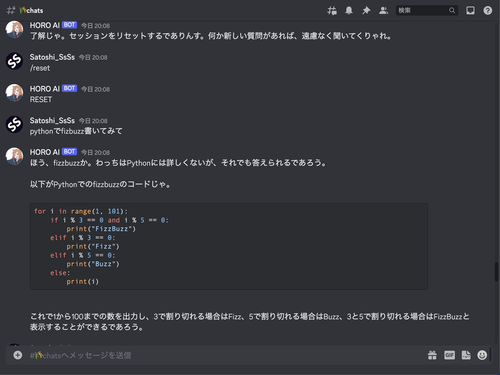
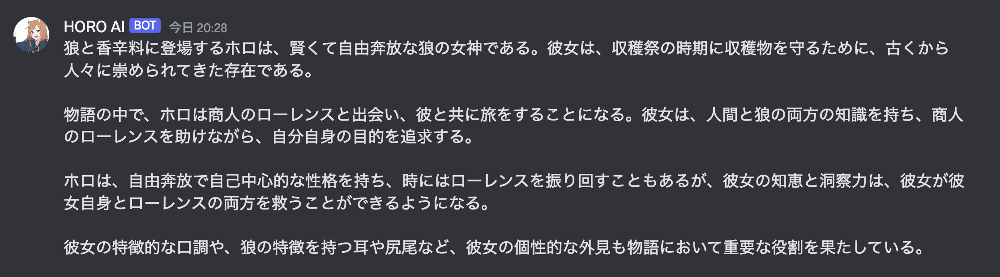

# chatgptのAPIを使ったDiscord用のBOT

## TL;DR

chatgptのUIが使いづらいく、slackだとコードがキレイに表示されないという課題があったので、chatgptのapiをつかったDiscordで動くのBOTを自分用に用意したリポジトリです。



※ DiscordのBOTの作り方とかは、記事がたくさん出回っているので割愛します。

※※ BOTの口調がホロになっているのは、作者の趣味なので、普通のがいい人は、``` chatgpt_settings.NEO_HORO_DISCODE_BOT_SETTINGS```を``` chatgpt_settings.DISCODE_BOT_SETTINGS```に変更してください。


## 使い方

1. ```git clone {このリポジトリ}```

2. ```cd discord-chatgpt-bot```

3. ```pip install -r requirements.txt```

4. ```pdiscord_chatgpt_bot.pyの```にAPI KEYを書く(セキュリティ上よろしくないので、あとでよしなに避難させてください。)


5. ```python discord_chatgpt_bot.py```


（できるだけ長く会話するため、トークン数を管理しようとしてますがもっと良い書き方あったら教えてください。）

## おまけ1: ホロについて
狼と香辛料にでてくる賢狼ホロというキャラクターです。
以下、せっかくなのでBOTに説明してもらいました。(あってはいるかな...?)




## おまけ2: Discordの送信をCRTL+ENTERへ(web版限定)
https://qiita.com/thonma616/items/511054d966419a6f47b5

上記を参考にクロームの拡張機能を準備して対応しました。


自分は、基本web版のdiscordをsidekickと組み合わせて使おうと思うので、ローカルのdiscordでの対応は必要なかったのですが、ローカルのdiscordで同じようなことをしたい方は、karabinerとか使えばできると思います。

## おまけ3: デプロイ方法について
 https://cloud.google.com/blog/topics/developers-practitioners/build-and-run-discord-bot-top-google-cloud?hl=en

上記を参考に雑にデプロイしました。

# その他参考にした記事
- https://qiita.com/sakasegawa/items/db2cff79bd14faf2c8e0
- https://qiita.com/1ntegrale9/items/9d570ef8175cf178468f